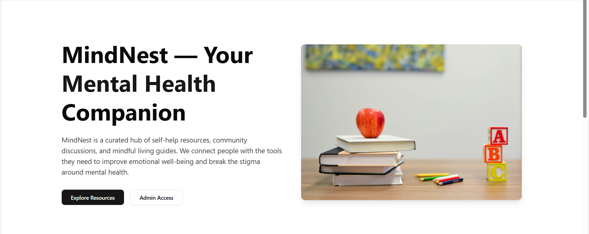
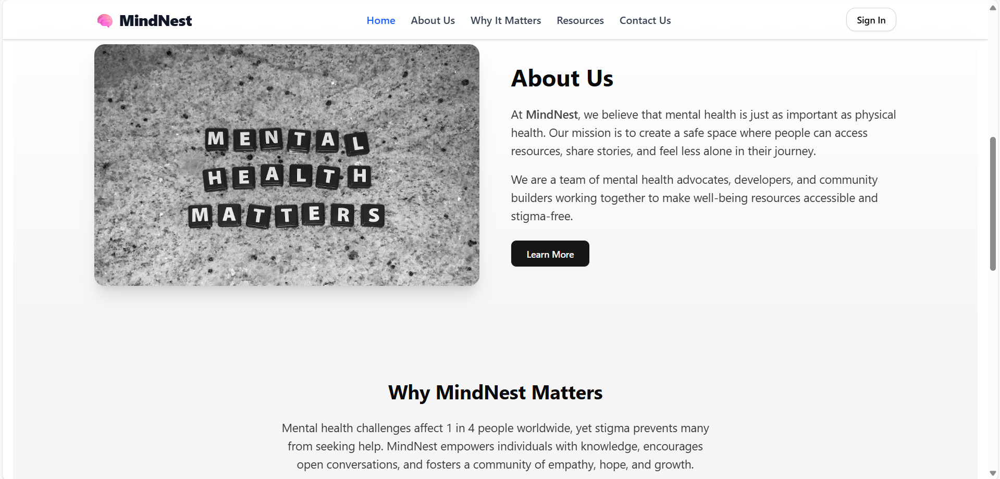

# 🧠 MindNest — Your Mental Health Companion




MindNest is a curated hub of **self-help resources**, **community discussions**, and **mindful living guides**.  
We connect people with the tools they need to improve emotional well-being and **break the stigma** around mental health.

---

## 🌟 Features
- 📚 **Articles & Guides** — Read curated mental health content from trusted sources.
- 📝 **Self-Assessment Tests** — PHQ-9 and GAD-7 questionnaires for personal insight.
- 💬 **Community Interaction** — Comment and bookmark articles you find helpful.
- 🔐 **Secure Admin Dashboard** — Add, edit, and manage resources with Clerk authentication.
- 🎨 **Modern UI** — Built with TailwindCSS, ShadCN, and Framer Motion animations.

---

<!-- ## 🖼️ Screenshots
### Landing Page


--- -->

## 🛠️ Tech Stack
**Frontend**  
- React.js  
- TailwindCSS + ShadCN UI  
- Framer Motion for animations  

**Backend**  
- Express.js (ESModules)  
- MongoDB for data storage  
- Clerk for authentication  

**APIs**  
- Gemini API for AI-powered suggestions

---

## 🚀 Getting Started

### 1️⃣ Clone the Repository
```bash
git clone https://github.com/PRATYAKSH15/MindNest.git
cd mindnest

