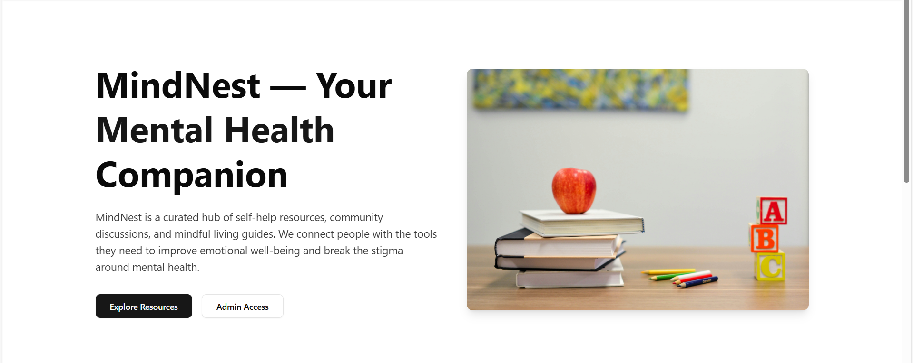
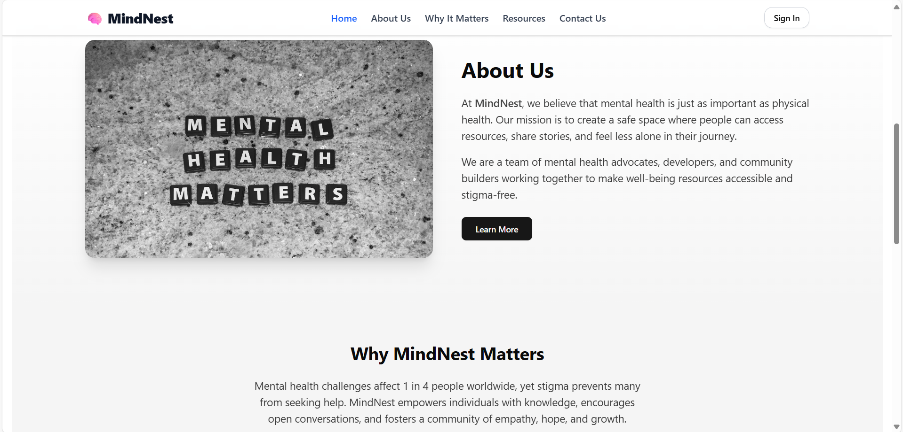

# 🧠 MindNest — Your Mental Health Companion




MindNest is a full-stack mental wellness platform offering **curated resources**, **self-assessment tools**, **mood tracking**, and **community features** — all in one place. Built to help people improve emotional well-being and **break the stigma** around mental health.

---

## 🌟 Features

- 📚 **Articles & Guides** — Browse, search, and filter curated mental health articles by tags and topics.
- 📝 **Self-Assessment Tests** — PHQ-9 and GAD-7 questionnaires with scored results and interpretation.
- 😊 **Mood Tracker** — Log your daily mood (1–5 scale) and visualize your 7-day history.
- 🌬️ **Breathing Exercises** — Guided breathing sessions for stress and anxiety relief.
- 📊 **Weekly Wellness Report** — Auto-generated report based on your mood and assessment data.
- 💬 **Community Interaction** — Comment on and bookmark articles you find helpful.
- 👤 **User Profiles** — Manage your personal profile and wellness history.
- 🔐 **Secure Admin Dashboard** — Add, edit, and manage resources with Clerk authentication.
- 🎨 **Modern UI** — Built with TailwindCSS, ShadCN, and Framer Motion animations.

---

## 🛠️ Tech Stack

### Frontend

- React 19 + React Router 7
- Vite (build tool)
- TailwindCSS 4 + ShadCN UI (Radix UI)
- Framer Motion (animations)
- Clerk React (authentication)
- Axios + Sonner (API calls & toast notifications)

### Backend

- Express.js 5 (ESM modules)
- MongoDB + Mongoose (data storage)
- Clerk SDK for Node.js (auth middleware)
- CORS, Multer, Body Parser (middleware)

### APIs

- Gemini API — AI-powered content suggestions

---

## 📁 Project Structure

```text
MindNest/
├── client/          # React frontend (Vite)
│   └── src/
│       ├── pages/   # Home, Articles, Assessments, MoodTracker, Breathing, Profile, etc.
│       └── components/
└── server/          # Express.js backend
    ├── models/      # Article, Comment, Bookmark, MoodEntry, AssessmentResult, Profile, Feedback
    └── routes/      # articles, assessments, bookmarks, comments, mood, profile, feedback, weekly-report
```

---

## 🚀 Getting Started

### 1️⃣ Clone the Repository

```bash
git clone https://github.com/PRATYAKSH15/MindNest.git
cd MindNest
```

### 2️⃣ Install Dependencies

```bash
# Install client dependencies
cd client
npm install

# Install server dependencies
cd ../server
npm install
```

### 3️⃣ Configure Environment Variables

Create a `.env` file in the `server/` directory:

```env
MONGODB_URI=your_mongodb_connection_string
CLERK_SECRET_KEY=your_clerk_secret_key
GEMINI_API_KEY=your_gemini_api_key
PORT=5000
```

Create a `.env` file in the `client/` directory:

```env
VITE_CLERK_PUBLISHABLE_KEY=your_clerk_publishable_key
VITE_API_URL=http://localhost:5000
```

### 4️⃣ Run the App

```bash
# Start backend (from server/)
npm run dev

# Start frontend (from client/)
npm run dev
```

The app will be available at `http://localhost:5173`.

---

## 🗄️ Database Models

| Model | Description |
| --- | --- |
| `Article` | Mental health articles with tags and metadata |
| `Comment` | User comments on articles |
| `Bookmark` | Articles saved by users |
| `MoodEntry` | Daily mood logs (1–5 scale with timestamps) |
| `AssessmentResult` | PHQ-9 / GAD-7 test results |
| `Profile` | User profile information |
| `Feedback` | User feedback and suggestions |

---

## 🤝 Contributing

1. Fork the repository
2. Create a feature branch: `git checkout -b feature/your-feature`
3. Commit your changes: `git commit -m 'Add your feature'`
4. Push to the branch: `git push origin feature/your-feature`
5. Open a Pull Request

---

## 📄 License

This project is open source and available under the [MIT License](LICENSE).
